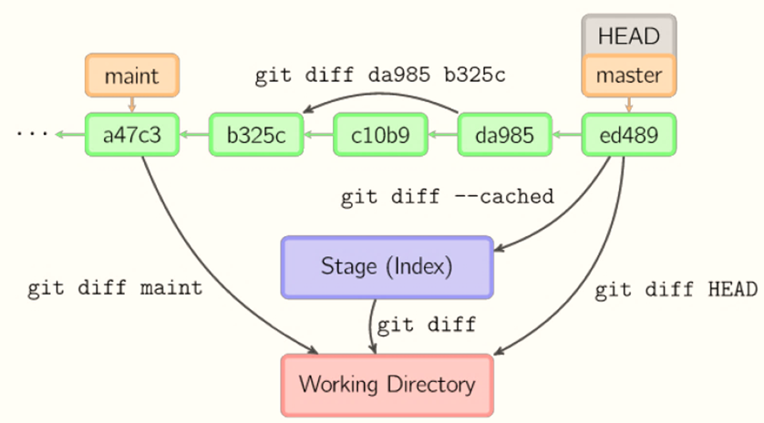

## 目录

### git add
- 将代码从工作区交付到暂存区

### git commit 
- 将代码从暂存区交付到仓库

### git push
- 将代码从本地提交到远程仓库

#### git push -f 
- 回撤远程仓仓库

### git pull
- 将代码从元辰仓库拉下来

### git clone 
- 将整个远程仓库复制到本地

### git config 
- 对当前用户进行配置

#### git config user.name 
- 配置用户名

#### git config --global user.email
- 配置邮箱

#### git config --global core.safecrlf false
- 在Windows环境下起作用

#### git config --global alias 
- 给命令起一个简单的别名

#### git config --global credential.helper wincred
- 自动保存使用http协议push和pull时使用的账号和密码

### git reset HEAD
- 将仓库回退到最后一次commit之前的状态

### git remote 
- 远程仓库的相关操作

### git help
- 查看git支持的命令

### git blame
- 查看谁修改了文档

### git log
- 查看历史提交记录

#### git log <filename>
- 查看某一文件提交的历史

### git clean 
- 清除工作区中内容

### git rm 
- 删除文件
- 删除工作区的内容

### git mv
- 文件重命名
- 移动文件位置

### git add -p
- 分块提交同一文件中的内容

### git commit -a -m "message"
- 将文件从工作区直接提交到仓库当中

### git show 
- 显示提交的信息

#### git show HEAD
- 显示最后一次提交的信息

### git diff
- 比较文件之间的内容差别
- git diff: 比较工作目录与暂存区之间的文件的区别，也就是为提交到暂存区的内容
- git diff --cached： 比较暂存区域仓库之间的区别，也就是显示要提交到仓库的内容
- git diff HEAD：比较工作目录与仓库最后一次提交之间的区别
 
- 绿色部分表示的是已经提交到仓库中的内容

### git reset

#### git reset HEAD
- 回撤暂存区的内容到工作目录

#### git reset HEAD^ --soft
- 回撤提交到暂存区

#### git reset [hashcode] --hard
- 回撤提交，放弃变更

### git checkout [commit hashcode] [filename]
- 将指定的文件从仓库中恢复到工作区中

### 先git add . 后git commit --amend -m "message"
- 回撤最后一次的提交

### git rebase -i HEAD~3
- 变基操作，改写历史提交

### git show
- 查看提交的具体情况

### git tag

#### git tag foo
- 在当前的提交上，打标签foo

#### git tag foo -m "message"
- 在当前的提交上，打标签foo，并给message信息注释

#### git tag foo HEAD~4 
- 在当前提交之前的第四个版本上，打标签foo

#### git tag 
- 列出所有的标签

#### git tag -d tagname
- 删除标签

#### git push origin --tags
- 把本地所有标签推送到远程仓库

#### git push origin tagname
- 将本地指定的标签推送到远程操仓库上

#### git push origin :refs/tags/tagname
- 删除远程仓库中标签名为tagname的标签

